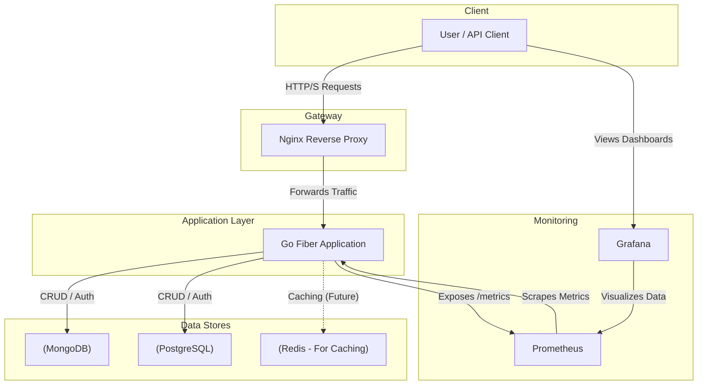

# Hotel Reservation System

A backend API for a hotel reservation system built with Go. This project features a dual-database architecture, supporting both MongoDB and PostgreSQL.

## Architecture

The system is designed to be containerized and includes services for the main application, databases, a reverse proxy, and monitoring.



## Features

- **User Management**: User registration and authentication.
- **Hotel & Room Management**: Create, view, and manage hotels and rooms.
- **Booking**: Handle room bookings and reservations.
- **Dual-Database Support**: Seamlessly works with both MongoDB and PostgreSQL.
- **Monitoring**: Integrated with Prometheus and Grafana for performance monitoring.

## Technology Stack

- **Backend**: Go, Fiber
- **Databases**: MongoDB, PostgreSQL
- **Authentication**: JWT
- **Containerization**: Docker, Docker Compose
- **Proxy**: Nginx
- **Monitoring**: Prometheus, Grafana

## Getting Started

### Prerequisites

- Docker
- Docker Compose
- Go (for local development)
- Make

### Running with Docker

The entire stack can be launched using Docker Compose.

1.  **Clone the repository:**
    ```sh
    git clone https://github.com/your-username/hotel-system.git
    cd hotel-system
    ```

2.  **Run the services:**
    This command will start the Go application, databases, Nginx, Prometheus, and Grafana.
    ```sh
    docker-compose -f deployments/docker-compose.yaml up -d
    ```

3.  **Access the services:**
    - **API**: `http://localhost:80` (via Nginx)
    - **Grafana**: `http://localhost:3000`
    - **Prometheus**: `http://localhost:9090`

### Local Development

To run the application locally without Docker:

```sh
# Build and run the application
make run
```